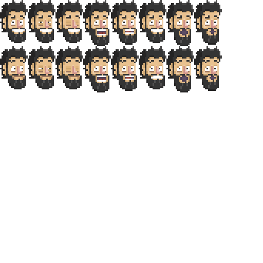
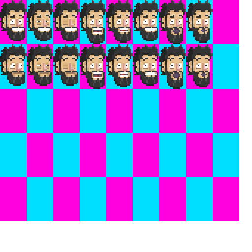

# ROGER.JS
# The easiest animation library for frame by frame animations

Roger.js is a personal project made it entirely in EcmaScript by **Pablo Jiménez Beneyto**.
Focus on having an easy animation library for my pixel art and my browser games,
I decide to create it instead of using another game engines or libraries such as Phaser.JS.
PLUS I could try all the new things EcmaScript6 comes within and I can't use in my workday.

So, welcome!

## Version: 1.0.7
Minor improvements adding getters to the classes and scoping the npm package under the name: **@pabrick/roger.js**

## Version: 1.0.4
I give up a little bit on my TypeScript version ~~Roger.ts~~, because I like to focus on the new EcmaScript possibilities and because I would like to make this library the spine of a browser game made entirely with VanillaJS.
So I'd improved a little bit this project, using **Maps** instead some **Arrays**, and avoid crossed references.
The **RogerObject** don't have to me instanciated with a clock, making easier to handle, from the **RogerClock**.
I have get rid of the CSS, so everything is done dynamically (so cool).

## Version: 1.0.3
I have evolved this project into a TypeScript project, so I stop right here, until I discover how to bundle all the classes properly.
In the meantime, I will continue developing in ~~Roger.ts~~

## Version: 1.0.1
I have inlcude a new RogerSheet: the RogerRegularSheet.
Sometimes (or mostly) we use sprite sheets wich sprites have the same sizes. For those cases we use **RogerRegularSheet**
Instead pasing as parameter an array with all the sizes and positions, we only give it an object with width and height.
So it will be easier!


## Let's begin!

First install the library from NPM:
```
npm i roger.js
```

Or add it manually to your project:
```
<script src="js/roger.bundle.js"></script>
```

### 1. The Clock (RogerClock)

Like all the videogames thast use a finite-state machine, we need some clock signal attached to the delta.
We are going to use **delta** as the elapsed time between one frame and another, so be careful about that!
Our **delta** is going to be **0.1**.
We use our **RogerClock** for that purpose:
```
const rClock = new RogerClock(0.1);
rClock.start();
```
**We will link our animations to this clock later!**

### 2. The Sprite Sheet (RogerSheet)

Now we need an animation sheet, sprite sheet or atlas.
The sprite sheet should be power 2 size. I recommend 1024, but I will use 512x512 px.



Roger.JS use the object **RogerSheet**, we give it params:
- URL of the sprite sheet.
- Object with the sizes of the sprite sheet
```
{
    w: widthInPixels, 
    h: heightInPixels
}
```
- **An array with all the sprites inside the sprite sheet** 
Every object inside of the array have to be like this:
```
{
    w: width of the sprite,
    h: height fo the sprite,
    x: horizontal position of the sprite,
    y: vertical position of the sprite
}
```
Unless all the sprites have the same size. In that case we can make it shorter,
using the object **RogerRegularSheet** and instead give the array with all the frame's positions,
we just give and object with the size of the sprite (and how all the sprites are the same size, Roger.JS makes all the calcullations. Pretty cool, eh?):
```
{
    w: width of the sprite,
    h: height fo the sprite
}
```

So, like our sprite sheet has all the sprites of the same size, we can use the shorter way:
```
var ss_damnPablosHeads = new RogerRegularSheet("img/damn_pablos_heads.png", {w:512, h:512}, [{w:54,h:90}]);
```
Here's a tip of how this sprite sheet is made:



### 3. The Animations (RogerAnimation)

We are going to create our first animation using our element **RogerAnimation** and giving it params as:
- Name
- A sprite sheet (rogerSheet instance in fact)
- An array with indexes of the frames that make the animation
- An object with all the options of the animation, such as: forward or backwards, random frames, infinite loops, delays, callBack function, etc.
```
var anim_damnPablos_blink1 = new RogerAnimation("blink1",
                                                ss_damnPablosHeads,
                                                [0,1,2,1],
                                                { delay: 60, callBack: ()=>console.log('oli') });
```

In case you don't remember the options or you forget them, the animation comes with default options. These options will be overwritten by the options that you gave it.
The default options are:
```
defaultOptions = {
    delay: 0,
    loops: 0,
    direction: "forward",
    callBack: null
}
```

But you can custom your options like this:
- Delay: time in **deltas** before your animation starts moving
- Loops: number of times your animations will repeat. **0 (Zero) plays once, and -1 plays infinite times**
- Direction: direction of the animation, by the time I only have: "forward", "backward" and "random" **IMPORTANT: "random" also makes your animation plays infinite times**
- CallBack: just in case you need it, you can add one function and it will execute at the end of the loop.

### 4. The DisplayObject (RogerObject)

As a Adobe Flash user and lover I have design the library in the same way. You have an visual object and you attach it animations. But only one animation will be playing at the same time.
We give it the params:
- ID of the DIV in the HTML


## Let's use it! ##

1º We instanciate our sprite sheet
```
const ssPablosHeads = new RogerRegularSheet('img/damn_pablos_heads.png', {w:512,h:512}, {w:54,h:90});
```

2º We create some animations
```
const animPablos_blink1 = new RogerAnimation('blink1',
                                             ssPablosHeads,
                                             [0,1,2,1,0],
                                             { delay: 5, loops: -1, callBack: ()=> { console.log('blink complete!'); }
                                             });
```

2º We create animation controller or DisplayObject
```
const pabloObject = new RogerObject('pablo');
```

3º We add the animations we desire to our RogerObject
```
pabloObject.addAnimation(animPablos_blink1);
```

4º We set this animation as our current playing animation
```
pabloObject.playAnimation('blink1');
```
But for the moment we can't see it, because we don't have a clock associated to that RogerObject,
so let's create one.

5º We create the clock that makes everything work and tic at the same tempo
```
const rClock = new RogerClock(0.1);
```

6º Now we only have to link our animation to the clock
```
rClock.addObjectToUpdate(pabloObject);
```

7º Whenever you want **START**
```
rClock.start();
```

**THANKS!**
