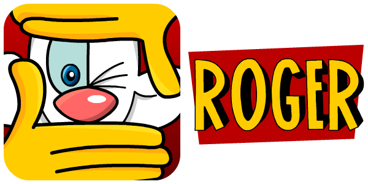
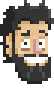
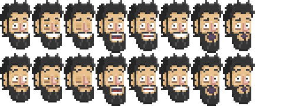
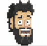
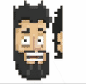
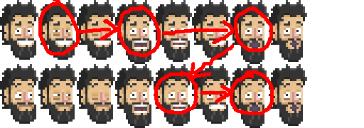

# @pabrick/roger [](https://badge.fury.io/js/%40pabrick%2Froger)



# The easiest animation library for _frame by frame_ animations

**Roger** is a personal project made entirely in EcmaScript by **Pablo (Pabrick) Jiménez Beneyto**.
It focuses on providing an easy animation library for pixelart and browser games, using CSS properties manipulation in spritesheets used as backgrounds.
I decided to create it from scratch instead of using other game engines or libraries such as [PhaserJS](https://phaser.io/).

_I also use this chance to try out all new features that EcmaScript6 brings as I can't use them in my day-to-day work_.

# How it works

## Let's begin with basics:

## Sprite

An image used in a videogame (old school at least) is called a **sprite**.
The **sprites** are grouped in a bigger image known as a **spritesheet**.



## Spritesheet

The **spritesheets** are stored in the memory as square blocks, if the image isn't square, the computer will make it square anyway, that's why it's better to create square **spritesheets** to better use the space.
The **sprites** within the **spritesheet** can all have the same size or different sizes.



#### **NOTE: CURRENTLY I only have developed _spritesheets_ that have same sized _sprites_.**

## Animation

When we play several images one after another in a certain time, it looks like the images are moving, and that's called **animation**.



I like to take advantage of that, so instead of changing one image by another I just set the whole **spritesheet** as a background, crop just one **sprite** size and move the background very fast like a pattern in a window.



Doing that the computer uses the GPU _(CSS)_ instead the CPU _(JS)_ to create the **animation**.

Because an **animation** is a group of images or **sprites**, different combinations can make different **animations**. So a **spritesheet** can have many **animations** within itself. We only have to set which **sprites** compose the **animation**.



## Toon

A **toon** is an object that groups different **animations**. As a true fan of _ActionScript_ I wanted to bring back the idea of the _DisplayObject_ but as _object_ is a reserved word I decide to name them after the cartoon characters in "Who Framed Roger Rabbit". A _hero_ for example can have different **animations** like: walk, run, attack, duck, etc.

## Clock

If we have different **toons** and different **animations** we may want (and should) synchronize them all. Every **animation** has to _follow the beat_ like if it were following a _metronome_. That will help us to control the **animations** and that's why we need a **clock**.
Our **clock** (or **clocks**) have to know wich **animations** beat every time it ticks. So we have to add the **toons** with the **animations** to the **clock** like if it were _windup key_ of these **toons**.

# Install

With [npm](https://www.npmjs.com/):

```
npm i @pabrick/roger
```

# Usage

```js
import Roger from '@pabrick/roger';
```

We create and _idle_ [sprite](#sprite) passing the **spritesheet** _url_, the **sprite** _size_ and the **sprite** _position_.

```js
let mySprite = new Roger.Sprite(
  'img/damn_pablos_heads.png',
  { w: 54, h: 90 },
  { x: 0, y: 0 }
);
```

We define the [spritesheet](#spritesheet) for our **animations** passing the **spritesheet** _url_, the **spritesheet** _size_ and the **sprite** _sizes_.

```js
let mySpriteSheet = new Roger.RegularSheet(
  'img/damn_pablos_heads.png',
  { w: 512, h: 512 },
  { w: 54, h: 90 }
);
```

#### **NOTE:** We are using **RegularSheet** because all our **sprites** have the same size, otherwise we should use **Sheet** and pass an array of **sprite** sizes. **Unfortunately** **Sheet** class development is not finished yet.

If our _idle_ **sprite** uses the same **spritesheet** as our **animations**, we can use that instance when we create the **sprite**:

```js
let mySprite = new Roger.Sprite(
  mySpriteSheet.url,
  { w: 54, h: 90 },
  { x: 0, y: 0 }
);
```

Now we can create our [animation](#animation) with the proper parameters:

```js
let myAnimation = new Roger.Animation('blink', mySpriteSheet, [0, 1, 2, 1, 0], {
  delay: 10,
  loops: 3,
  direction: 'forward',
  callback: () => {
    console.log('blink complete!');
  },
});
```

- Name of the **animation**
- Instance of the **spritesheet**
- Array with the _positions_ of the **sprites** that compose the **animation**
- Options or configuration of the **animation** (_optional_):
  - **delay**: time before animation starts **[default: 0]**
  - **loops**: number of times an **animation** repeats (_-1_ for inifite loops) [default: infinite]
  - **direction**: how the **animation** plays (_forward_, _backward_ or _random_) [default: forward]
  - **callback**: _function_ that executes as the **animation** ends [default: none]

**All the parameters in the options are optional**, so you only need to add the ones that you want to change from its default configuration. Their default values are:

- **delay**: no delay (0)
- **loops**: infinite (-1)
- **direction**: forward
- **callback**: none

> #### **NOTE:** _Random_ animations play in infinite loops because the **animation** does not know which is its last **sprite**.

We can now create our [toon](#toon) and add an **animation**.

```js
let myToon = new Roger.Toon('pablo', pabloIdleSprite);
myToon.add(myAnimation);
```

Finally we only need to create our [clock](#clock) with the _delta_ we want to use as a parameter (_0.1_ seconds in our case). Add our **toon** to the **clock**'s update queue and make it start working!

```js
let myClock = new Roger.Clock(0.1);
myClock.addToList(myToon);
myClock.start();
```

# API

## Roger.Sprite

### Constructor:

```
Roger.Sprite (url, size, position)
```

- **url**: _{string}_ path of the **spritesheet**.
- **size**: _{object}_ width and height of the **sprite**.
- **position**: _{object}_ top position (row) and left position .(column) on the **spritesheet** from 0.0.

### Getters:

- **url**: _{string}_ path of the **spritesheet**
- **w**: _{number}_ width of the **sprite**
- **h**: _{number}_ height of the **sprite**
- **x**: _{number}_ top position (row) on the **spritesheet** from 0.0
- **y**: _{number}_ left position (column) on the **spritesheet** from 0.0

## Roger.Sheet & Roger.RegularSheet

### Constructor:

```
Roger.Sheet (url, size, sprites)
Roger.RegularSheet (url, size, sprites)
```

- **url**: _{string}_ path of the **spritesheet**.
- **size**: _{object}_ width and height of the **spritesheet**.
- **sprites**: _{array}_ sizes of each **sprite**.

### Getters:

- **url**: _{string}_ path of the **spritesheet**.

### Methods:

- **getSprite**: _{number}_ returns the **sprite** in that position.

## Roger.Animation

### Constructor:

```
Roger.Animation (name, spriteSheet, frameList, options)
```

- **name**: _{string}_ name of the **animation**.
- **spriteSheet**: _{Roger.Sheet || Roger.RegularSheet}_ instance of the **spriteSheet**.
- **frameList**: _{array}_ the number of the **sprites** that compose the **animation**.
- **options**: _{object}_ (optional) how **animation** is configured.

> **NOTE**: if no options are provided, default options are **NO DELAY**, **INFINITE LOOP** and play **FORWARD**.

### Getters:

- **url**: _{string}_ path of the **spritesheet**.
- **name**: _{string}_ name of the **animation**.
- **hasCallback**: _{boolean}_ get if the **animation** has a function when it ends.
- **hasFinished**: _{boolean}_ get if **animation** has finished.

### Methods:

- **setOption**: _{object}_ set new _options_ for the **animation**.
- **getSprite**: _{number}_ returns the **sprite** in that position.
- **executeCallback**: execute the function linked to the **animation** ends.

## Roger.AnimationOptions

### Constructor:

```
Roger.AnimationOptions (delay, loops, direction, callback)
```

- **delay** {number} time before the **animation** starts
- **repeat** {number} number of times the **animation** repeats
- **direction** {string} order of the frames
- **callback** {Function} function executed after the **animation** ends

## Roger.Toon

### Constructor:

```
Roger.Toon (id, idle)
```

- **name**: _{string}_ name of the **animation**.
- **idle**: _{Roger.Sprite}_ (optional) **sprite** by default when **toon** has no **animation** loaded.

### Methods:

- **update**:
- **add**: _{Roger.Animation}_ make an **animation** as part of this **toon**.
- **play**: _{string}_ plays the **animation** with the name provided.
- **stop**: stops the current animation, showing the idle sprite.

## Roger.Clock

```
Roger.Clock (delta)
```

- **delta**: _{number}_ time in seconds for each tick or step.

### Methods:

- **init**: initilize the **clock** without starting.
- **initWith**: _{number}_ initilize the **clock** with a number without starting.
- **start**: initilize AND starts the **clock**.
- **startWith**: _{number}_ initilize with a number AND starts the **clock**.
- **pause**: pause the **clock**.
- **stop**: stops the **clock**.
- **update**: makes the **clock** ticks.
- **updateWith**: _{number}_ update the clock manually. No need of init or start. Pause doesn't work with this option.
- **addToList**: _{Roger.Toon}_ add and **toon** to the update queue.
- **clearList**: empty the update queue.
- **setDebugMode**: _{boolean}_ log by console the _delta_.

# License

## MIT

# **THANKS!**

- To [Mario Morales](https://twitter.com/MarioDibujanto/) for the design of the logo.
- To my code colleagues for their advices and support: [Christian Lugo](https://es.linkedin.com/in/chrislugram), [Jorge López](https://es.linkedin.com/in/jorgelopezgonzalez) y [Alberto Cejas](https://es.linkedin.com/in/albertocejas).
- To **YOU**, if you are reading this. Feel free to comment your impressions.
