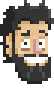
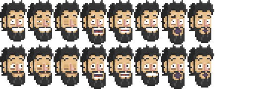
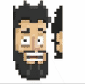
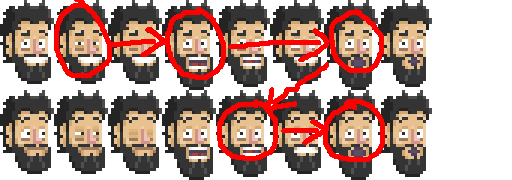

# @pabrick/roger [](https://badge.fury.io/js/@pabrick/roger)
# The easiest animation library for frame by frame animations

**Roger** is a personal project made it entirely in EcmaScript by **Pablo (Pabrick) Jiménez Beneyto**.
Focus on having an easy animation library for pixelart and browser games using CSS properties manipulation in spritesheets used as backgrounds.
I decide to create from scratch instead using another game engines or libraries such as [PhaserJS](https://https://phaser.io/).

*I also can play with all new features that EcmaScript6 brings and I can't use them in my everyday work*.

## Version: 1.0.9
- Functional NPM publish

## Version: 1.0.8
- Upgrades on packages like Webpack 4 and Babel 7.
- Export classes in ES6.

## Version: 1.0.7
Minor improvements adding getters to the classes and scoping the npm package under the name: **@pabrick/roger.js**

## Version: 1.0.4
I give up a little bit on my TypeScript version ~~Roger.ts~~, because I like to focus on the new EcmaScript possibilities and because I would like to make this library the spine of a browser game made entirely with VanillaJS.
So I'd improved a little bit this project, using **Maps** instead some **Arrays**, and avoid crossed references.
The **RogerObject** don't have to me instanciated with a clock, making easier to handle, from the **RogerClock**.
I have get rid of the CSS, so everything is done dynamically (so cool).

## Version: 1.0.3
I have evolved this project into a TypeScript project, so I stop right here, until I discover how to bundle all the classes properly.
In the meantime, I will continue developing in ~~Roger.ts~~

## Version: 1.0.1
I have inlcude a new RogerSheet: the RogerRegularSheet.
Sometimes (or mostly) we use sprite sheets wich sprites have the same sizes. For those cases we use **RogerRegularSheet**
Instead pasing as parameter an array with all the sizes and positions, we only give it an object with width and height.
So it will be easier!


# How it works

## Let's begin with basics:

## Sprite

An image used in a videogame (old school at least) is called a **sprite**.
The **sprites** are grouped in bigger images knowed as **spritesheet**.



## Spritesheet

The **spritesheet** are stored in the memory in square blocks, if the image isn't square, the computer make it square anyway, that's why it's better create square **spritesheets** to benefit the space.
The **sprites** in the **spritesheet** can have all the same size or different sizes.



#### **NOTE: CURRENTLY I have only develop *spritesheets* that has same size *sprites*.**

## Animation

When we play several images one after another in certain time, we can see that they are look like the images are moving, and that's called **animation**.


I like to take advantage of that, so instead of changing one image from another I just set the whole **spritesheet** as a background, crop just one **sprite** size and move the background very fast like a pattern in a window.



Doing that the computer uses the GPU *(CSS)* instead the GPU *(JS)* for moving the **animation**.

Like an **animation** are a group of images or **sprites**, different combinations can make different **animations**. So a **spritesheet** can have many **animations** within. We only have to point which **sprites** compose the **animation**.



## Object

As a truly fan of *ActionScript* I wanted to bring back the idea of the *DisplayObject*. An **object** that groups different **animations**. So an **object** of a *hero* for example can have different **animations** as: walk, run, attack, duck, etc.

## Clock

If we have different **objects** and different **animations** we maybe want (and we should) that all of them are synchronized. All the **animations** have to *follow the beat* like if the were following a *metronome*. That will help us to control the **animations** and that's why we need a **clock**.
Our **clock** (or **clocks**) have to know wich **animations** beat every time it ticks. So we have to add the **objects** with the **animations** to the **clock** like if it were *windup key* of these **objects**.


# Install

With [npm](https://www.npmjs.com/):
```
npm i @pabrick/roger
```

# Usage
````js
import Roger from "@pabrick/roger";
````

We create and *idle* [sprite](#sprite) passing the **spritesheet** *url*, the **sprite** *size* and the **sprite** *position*.
````js
let pabloIdleSprite = new Roger.Sprite("img/damn_pablos_heads.png", {w:54, h:90}, {x:0, y:0});
````

We define the [spritesheet](#spritesheet) for our **animations** passing the **spritesheet** *url*, the **spritesheet** *size* and the **sprite** *sizes*.
````js
let ssPablosHeads = new Roger.RegularSheet("img/damn_pablos_heads.png", {w:512, h:512}, {w:54, h:90});
````
#### **NOTE:** We are using **RegularSheet** because all our **sprites** have the same size, otherwise we should use **Sheet** and pass and array of **sprite** sizes. **Unfortunately** **Sheet** class development is not finished yet.

If our *idle* **sprite** uses the same **spritesheet** as our **animations**, we can use that instance when we create the **sprite**:
````js
let pabloIdleSprite = new Roger.Sprite(ssPablosHeads.url, {w:54, h:90}, {x:0, y:0});
````

Now we can create our [animations](#animations) with the proper parameters:
````js
let animPablos_blink1 = new Roger.Animation("blink1",
                                             ssPablosHeads,
                                             [0, 1, 2, 1, 0],
                                             { delay: 10, loops: -1, callBack: ()=> { console.log("blink complete!"); }}
                                            );
````
- Name of the **animation**
- Instance of the **spritesheet**
- Array with the *positions* of the **sprites** that compose the **animation** 
- Options or configuration of the **animation**:
  - **delay**: time before animation starts.
  - **loops**: number of times an **animation** repeats (*-1* for inifite loops)
  - **direction**: how the **animation** plays (*forward*, *backward* or *random*)
  - **callBack**: *function* that executes as the **animation** ends.

#### **NOTE:** *Random* animations play in infinite loops due that the **animation** does not know which is its last **sprite**.

We can now create our [object](#object) and add and **animation**
````js
let pabloObject = new Roger.Object("pablo", pabloIdleSprite);
pabloObject.addAnimation(animPablos_blink1);
````

Optional we can add an *idle* **sprite** when we create our **object**

Finally we only left to create our [clock](#clock) with the *delta* we want to use as a parameter (0.1 seconds) in our case. Add our **object** to the **clock**'s update queue and make it start working!
````js
let rClock = new Roger.Clock(0.1);
rClock.addObjectToUpdate(pabloObject);
rClock.start();
````

# API

## Roger.Sprite
### Constructor:
````
Roger.Sprite (url, size, position)
````
- **url**: *{string}* path of the **spritesheet**
- **size**: *{object}* width and height of the **sprite**
- **position**: *{object}* top position (row) and left position (column) on the **spritesheet** from 0.0
### Getters:
- **url**: *{string}* path of the **spritesheet**
- **w**: *{number}* width of the **sprite**
- **h**: *{number}* height of the **sprite**
- **x**: *{number}* top position (row) on the **spritesheet** from 0.0
- **y**: *{number}* left position (column) on the **spritesheet** from 0.0

## Roger.Sheet & Roger.RegularSheet
### Constructor:
````
Roger.Sheet (url, size, sprites)
Roger.RegularSheet (url, size, sprites)
````
- **url**: *{string}* path of the **spritesheet**
- **size**: *{object}* width and height of the **spritesheet**
- **sprites**: *{array}* sizes of each **sprite**
### Getters:
- **url**: *{string}* path of the **spritesheet**
### Methods:
- **getSprite**: *{number}* returns the **sprite** in that position

## Roger.Animation
### Constructor:
````
Roger.Animation (name, spriteSheet, frameList, options)
````
- **name**: *{string}* name of the **animation**
- **spriteSheet**: *{Roger.Sheet || Roger.RegularSheet}* instance of the **spriteSheet**
- **frameList**: *{array}* the number of the **sprites** that compose the **animation**
- **options**: *{object}* how **animation** is configured
### Getters:
- **url**: *{string}* path of the **spritesheet**
- **name**: *{string}* name of the **animation**
- **hasCallBack**: *{boolean}* get if the **animation** has a function when it ends
- **hasFinished**: *{boolean}* get if **animation** has finished
### Methods:
- **setOption**: *{object}* set new *options* for the **animation**
- **getSprite**: *{number}* returns the **sprite** in that position
- **executeCallBack**: execute the function linked to the **animation** ends

## Roger.Object
### Constructor:
````
Roger.Object (id, idle)
````
- **name**: *{string}* name of the **animation**
- **idle**: *{Roger.Sprite}* (optional) **sprite** by default when **object** has no **animation** loaded
### Methods:
- **update**: 
- **addAnimation**: *{Roger.Animation}* make an **animation** as part of this **object** and
- **playAnimation**: *{string}* plays the **animation** with the name provided
- **stopAnimation**: *{string}* stops the **animation** with the name provided

## Roger.Clock
````
Roger.Clock (delta)
````
- **delta**: *{number}* time in seconds for each tick or step
### Methods:
- **init**: initilize the **clock** without starting
- **start**: initilize AND starts the **clock**
- **stop**: stops the **clock**
- **update**: makes the **clock** ticks
- **addObjectToUpdate**: *{Roger.Object}* add and **object** to the update queue
- **clearObjectToUpdate**: empty the update queue
- **setDebugMode**: *{boolean}* log by console the *delta*


# License 
## MIT

# **THANKS!**